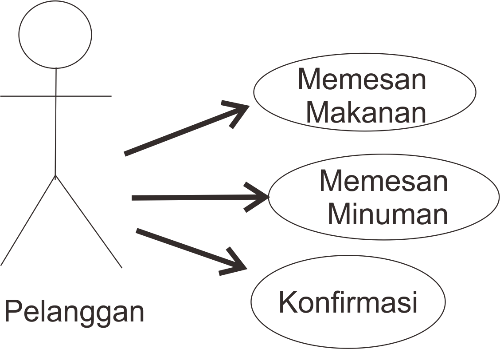
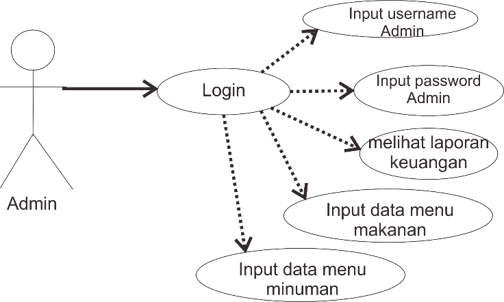

<b>Software Project Management Plan</b> 
"Sistem Informasi Absensi dan Penggajian Kafka Konveksi"

 

    <b>Kelompok 8:</b> 
    1. Rana Eka Millenio (1703082)  
    2. Iis Juita Sari (1703087) 
    3. Najwah (1703071) 

Kelas D3TI2C

 

 

**1.** **Pendahuluan**  
	**1.1**	**Tujuan**  
<ol>Dokumen ini akan menyajikan deskripsi rinci tentang APLIKASI SISTEM INFORMASI DAN MANAGEMENT PENJUALAN AYAM GEPREK ALHAMDULIHAH BERBASIS WEBSITE yang akan dikembangkan. Dokumen akan menjelaskan mengenai spesifikasi pada APLIKASI SISTEM INFORMASI DAN MANAGEMENT PENJUALAN AYAM GEPREK ALHAMDULIHAH BERBASIS WEBSITE seperti fitur sistem, antarmuka sistem, sistem apa yang akan dilakukan, apa saja kendala pada saat aplikasi beroperasi, dana bagaiman system akan bereaksi pada saat sedang digunakan oleh pemakai atau user.</ol>  

**1.2**	**Lingkup Masalah**  
<ol>Dokumen ini menyediakan acuan untuk pengendalian tentang APLIKASI SISTEM INFORMASI DAN MANAGEMENT PENJUALAN AYAM GEPREK ALHAMDULIHAH BERBASIS WEBSITE. Adapun ruang lingkup pembuatan aplikasi ini adalah berbasis website yang memilih beberapa fasilitas yang ada yaitu : 

1.	Admin untuk mengelola data CRUD (Create, Read, Update, Delete) yang ada pada fitur- fitur APLIKASI SISTEM INFORMASI DAN MANAGEMENT PENJUALAN AYAM GEPREK ALHAMDULIHAH BERBASIS WEBSITE seperti input menu makanan dan minuman, memonitoring laporan keuangan dan keuntungan .</ol> 
  
 
**1.3**	**Definisi, akronim, singkatan**  
		Adapun definisi dari dokumen tersebut adalah : 
		<table>
			<tr>
				<td> No </td>
				<td> Akronim </td>
				<td> Singkatan </td>
			</tr>
			<tr>
				<td> 1. </td>
				<td> SPMP </td>
				<td> Software Project Management Plan </td>
			</tr>
			<tr>
				<td> 2. </td>
				<td> SRS </td>
				<td> Software Requirements Specifications </td>
			</tr>
			<tr>
				<td> 3. </td>
				<td> SDD </td>
				<td> Software Design Document </td>
			</tr>
			<tr>
				<td> 4. </td>
				<td> DFD </td>
				<td> Data Flow Diagram </td>
			</tr>
			<tr>
				<td> 5. </td>
				<td> IEEE </td>
				<td> International Institute of Electronic and Electrical Engineers </td>
			</tr>
			<tr>
				<td> 6. </td>
				<td> CRUD </td>
				<td> Create, Read, Update, dan Delete </td>
			</tr>
		</table>
	**1.4**	**Referensi**  
IEEE. IEEE Std 830-1998 IEEE Recommended Practice for Software Requirements Specifications. 
	**1.5**	**Overview**  
<ol>Penulisan dokumen SRS ini dibagi menjadi beberapa bab sebagai berikut: 

**BAB I** berisi pendahuluan, menjelaskan mengenai tujuan pembuatan dokumen SRS, lingkup, definisi (akronim, atau singkatan), referensi, dan Overview. 

**BAB II** menjelaskan keseluruhan deskripsi dari Sistem Informasi Absensi dan Penggajian di Kafka Konveksi. Deskripsi umum tersebut memberikan gambaran lengkap mengenai semua fungsi yang akan dilakukan oleh sistem. 

**BAB III** berisi penjelasan detail dari  masing-masing kebutuhan lain yang spesifik. 

**BAB IV** berisikan tentang uraian mengenai informasi pendukung dalam pembuatan proyek Sistem Informasi Absensi dan Penggajian di Kafka Konveksi. </ol>

**2.** **Gambaran Umum** 
<ol>APLIKASI SISTEM INFORMASI DAN MANAGEMENT ADMIN AYAM GEPREK BERBASIS WEBSITE merupakan aplikasi untuk mempermudah Penjual memanagent data transaksi yang dilakukan di Ayam geprek alhamdulilah  tersebut . dimana Penjual sebagai admin yang dapat melakuakan proses CRUD menu makanan yang juga dapat merubah status  habis atau tidaknya makanan dan minuman yang ada dalam menu. </ol>

**2.1** **Perspektif produk** 
<ol>APLIKASI SISTEM INFORMASI DAN MANAGEMENT ADMIN AYAM GEPREK ALHAMDULILAH BERBASIS WEBSITE adalah aplikasi yang digunakan untuk memanagent data transaksi  melalui Website yang sebelumnya menggunaka metode manual dengan menulis data transaksi. Kemudian APLIKASI SISTEM INFORMASI DAN MANAGEMENT ADMIN AYAM GEPREK ALHAMDULILAH BERBASIS WEBSITE juga dapat melakukan proses CRUD menu makanan yang juga dapat merubah status  habis atau tidaknya makanan dan minuman yang ada dalam menu. </ol>

**2.1.1** **Antarmuka Sistem** 

**2.1.1.1**	**Use Cases Pelanggan** 

**2.1.1.2**	**Use Cases Admin** 

**2.1.2** **Antarmuka pengguna** 
<ol>APLIKASI SISTEM INFORMASI DAN MANAGEMENT PENJUALAN AYAM GEPREK ALHAMDULIHAH BERBASIS WEBSITE menggunakan antarmuka berbasis website. Dimana antarmuka antarmuka website digunakan oleh admin. </ol>

**2.1.3** **Antarmuka perangkat keras** 
<ol>
•	Laptop 
•	Processor Core i3 or higher 
•	Penyimpanan(Hardisk) Minimal 4 GB free space 
•	Monitor resolusi 1240 x 768 colors 5 
•	Keyboard dan mouse compatible with windows </ol>

**2.1.4** **Antarmuka perangkat lunak** 
<ol>Perangkat lunak yang dibutuhkan untuk aplikasi ini yaitu : </ol>
<ol>
•	Windows 7 or higher 
•	Android Studio 
•	Corel Draw X7 
•	Database Mysql 
•	Balsamiq Mockups 3 
•	Sublime Text 3 </ol>

**2.1.5** **Antarmuka komunikasi**  
<ol>
•	Paket Data 
•	Wifi 
•	Modem 
•	Smartphone </ol>

**2.1.6** **Batasan Memori** 
<ol>
•	RAM yang kami gunakan adalah minimal 4 gb. 
•	Memori yang dibutuhkan aplikasi minimal 50 mb. </ol>

**2.1.7**	**Operasi – operasi** 
<ol>
•	Input data makanan 
•	Input data minuman 
•	Input data jumlah barang yang di beli secara offline 
•	Update data makanan 
•	Update data minuman 
•	Menampilkan data User 
•	Menampilkan hasil penjualan harian 
•	Menampilkan history transaksi 
•	Menampilkan laporan keuangan perhari, perbulan, dan pertahun 
•	Arsip laporan kuangan </ol>

**2.1.8**	**Kebutuhan Adaptasi** 
<ol>Kebutuhan adaptasi yang diperlukan pada saat pengembangan aplikasi dengan menggunakan fungsi update data agar memudahkan admin dalam mengkoreksi pengetikan yang salah. <ol>

**2.2**	**Fungsi - fungsi Produk** 
<ol>
•	Memudahkan pelayanan  dalam mencatat pesanan pelanggan. 
•	Memberi tahu pelanggan menu mana yang habis dan yang tidak. 
•	Menambah list menu tanpa membuat list menu yang baru. 
•	Memudahkan pemilik usaha ayam geprek untuk melihat pendapatan maupun laporan keuangannya. </ol>

**2.3**	**Karakteristik Pengguna** 
<ol>
•	Pengguna mampu membaca dan menulis. 
•	Pengguna mengerti cara menggunakan PC dengan sistem operasi setidaknya windows. 
•	Mengerti cara menggunakan browser pada PC. </ol>

**2.4**	**Batasan – batasan** 
<ol>
•	Berjalan pada platform website 
•	Sementara ini aplikasi ini hanya untuk Geprek Alhamdulilah Indramayu 
•	Aplikasi ini tidak untuk layanan pesan antar </ol>

**2.5** **Asumsi – asumsi dan keterkaitan** 
<ol>APLIKASI SISTEM INFORMASI DAN MANAGEMENT PENJUALAN AYAM GEPREK ALHAMDULIHAH BERBASIS WEBSITE ini dapat dikembangkan lagi dengan menambah banyak café pengguna, dan penambahan super admin untuk konfirmasi café mana saja yang boleh menggunakan aplikasi ini. Sehingga aplikasi ini dapat digunakan oleh banyak café yang ingin menggunakan aplikasi ini. </ol>

**2.6**	**Kebutuhan – kebutuhan penyeimbang** 
•	Customer Requirements
<oL>Customer Requirements adalah analisis yang dilakukan terhadap pelanggan agar dapat mengetahui apa saja kebutuhan pelanggan sehingga pengembang dapat membuat sistem yang sesuai dengan kebutuhan pelanggan. </ol>
•	Detil Requirements
<ol>Detil Requirements adalah suatu analisis yang terdiri dari properti dan fungsionalitas spesifik yang diekspresikan dalam bentuk yang detail. <ol>